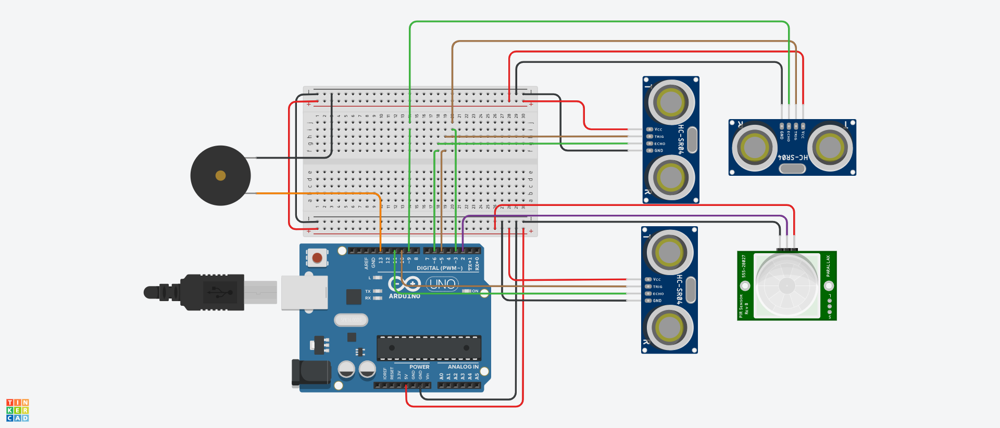
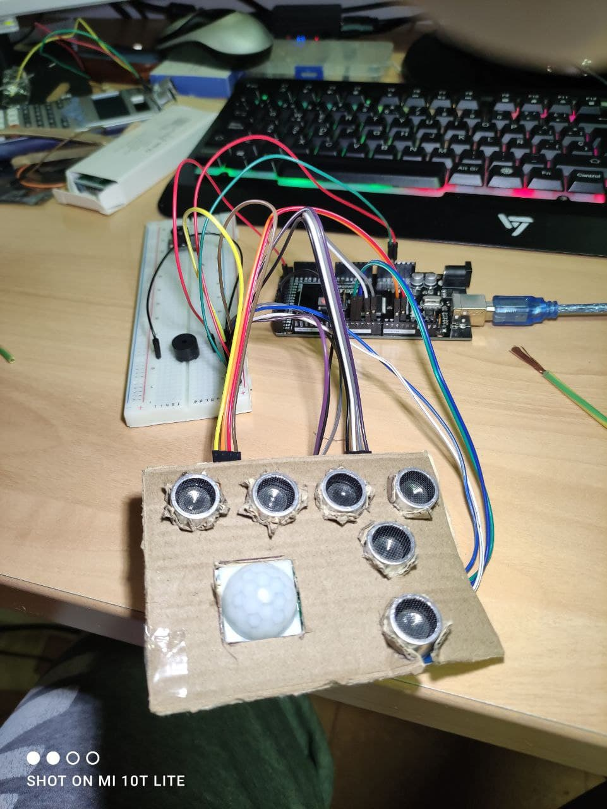
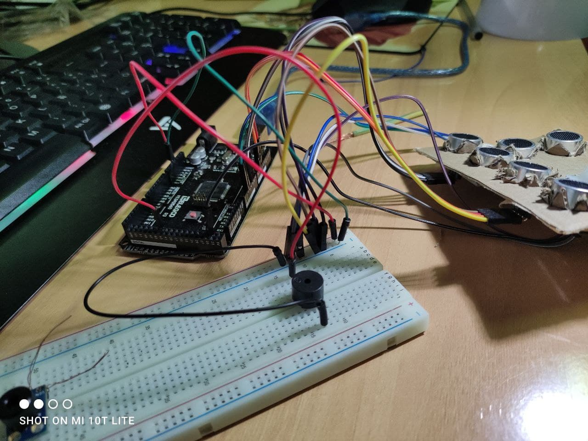
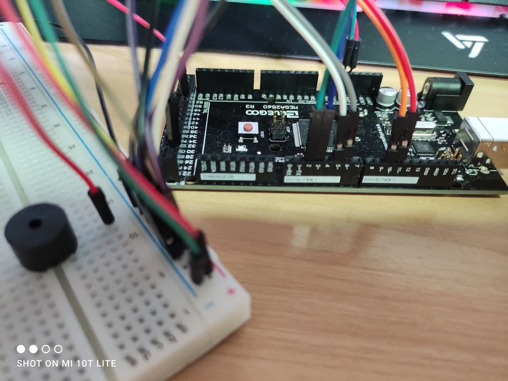

# Proyecto vestible con Arduino TE 2020

## Componentes
- Arduino Mega 2560: 1
- Sensor de distancia ultrasónico HC-SR04: 3. Pin (2,3),(5,6),(10,11).
- Sensor de movimiento PIRHC-SR501: 1. Pin 24.
- Buzzer: 4. Pin 42.

## Montage









## Implementación

```c++

```