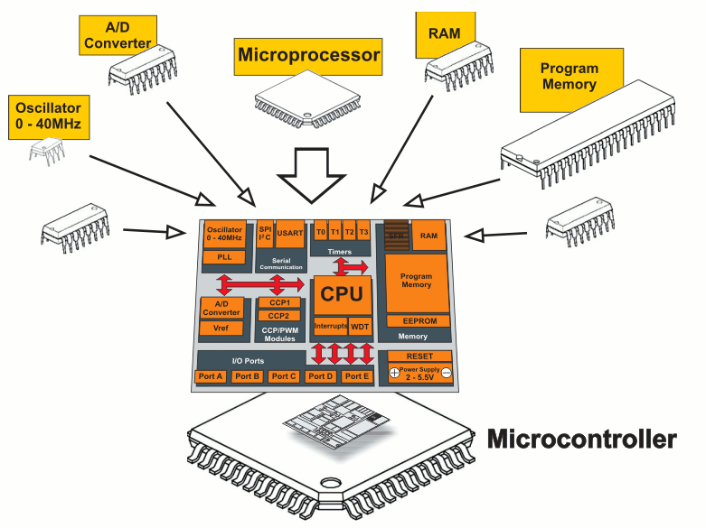
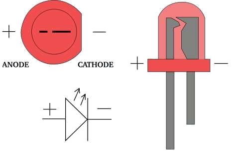
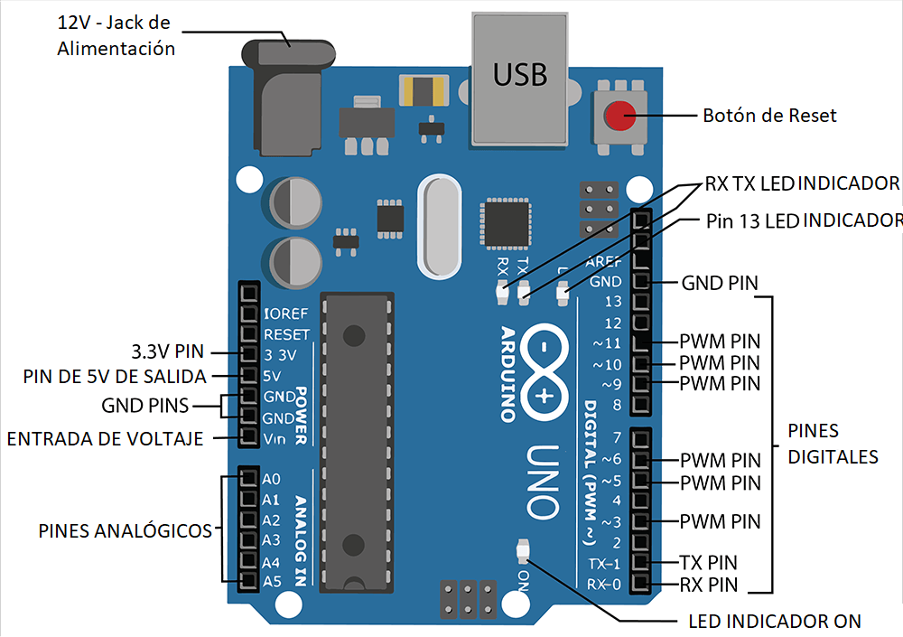
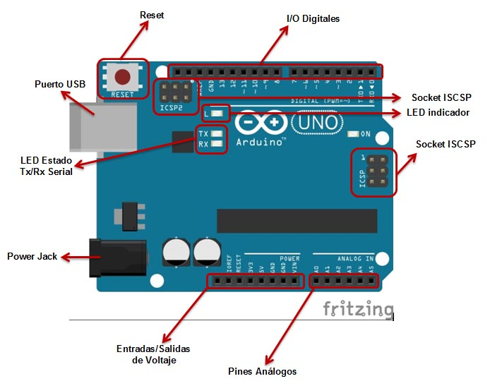
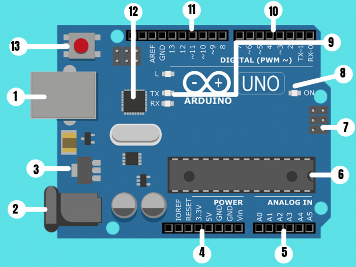
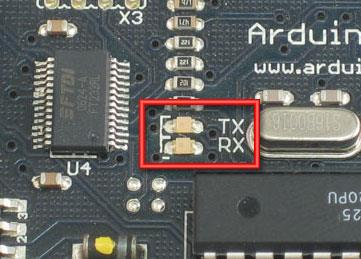

# Mini-guía Arduino

## concepto micro-controlador

- Es un computador en un solo chip
- Incluye procesador, memoria y Entrada/Salida
- Normalmente, “empotrados” en otro dispositivo al que controlan

<center>




</center>

## Polaridad de los led

<center>



</center>

## La placa

<center>






</center>

1. **Alimentación USB/5VDC (1 y 2)**:El Arduino UNO puede ser alimentado desde un cable USB de tipo B o mini procedente de tu ordenador o desde una fuente de alimentación entre 6V y 18V.  
Ademas, la conexión USB sirve para cargar código en la placa de Arduino desde donde se pueden enviar datos de la programación e instrucciones a la placa.
2. **Alimentación 5VDC**
3. **Regulador de voltaje**:El regulador de voltaje controla la cantidad de voltaje que se deja entrar en la placa de Arduino; por lo que no dejará pasar un voltaje superior al establecido que podría dañar el circuito.
4. **Conexiones**(Power pins): Los <u>pines o conexiones de Arduino</u> se utilizan para conectar los cables que se van a necesitar para construir un circuito. Este tipo de conexiones tiene varios pines, cada uno de los cuales está impreso en la placa y se utilizan para diferentes funciones:
    - **Reset**: Permite el reseteo del micro controlador.
    - **5V y 3.3V**: la clavija de 5V suministra 5 voltios de energía, y la clavija de 3.3V suministra 3.3 voltios de energía. La mayoría de los componentes simples usados con el Arduino funcionan bien con 5 o 3.3 voltios.
    - **GND**: Hay varios pines GND en Arduino, se usan para conectar a tierra el circuito.
    - **VIN**: Se usa para conectar la alimentación de la placa con una fuente externa de entre 6 y 12VDC.
5. **Puertos de entrada Analógicos**(Analog I/O pins): El área de pines bajo la etiqueta ‘Analog In’ (A0 a A5 en la UNO) son los pines de entrada analógica. Estos pines pueden leer la señal de un sensor analógico y convertirla en un valor digital que podemos leer e interpretar.
6. **Micro-controlador Atmega 328**: Esta zona de la placa es el circuito integrado que actúa como cerebro/procesador de la placa de Arduino sobre el que vamos a implementar la programación.
7. **Entrada ICSP (In Chip Serial Programmer)**: Esta entrada realiza la función de acceso directo para grabar, desde el PC al circuito, cualquier programa sin necesidad de utilizar el puerto USB.
8. **Indicador LED de alimentación**: LED de encendido de la placa de Arduino que indica si el microprocesador esta activo.
9. **LEDs TX RX**: `TX` es la abreviatura de transmisión de datos y `RX` es la abreviatura de recepción de datos. Estas marcas comunes aparecen con regularidad en la electrónica para indicar los pines responsables de la comunicación serie. Así mismo, Estos LEDs se activan visualmente cuando la placa esta recibiendo o transmitiendo datos.
10. **Puertos Digitales**(Digital I/O pins): Estos pines se pueden utilizar tanto para la entrada digital (como para indicar si se pulsa un botón) como para la salida digital (como para alimentar un LED).
11. **Puerto de conexiones**(Digital I/O pins):
    - 5 entradas o salidas auxiliares (de la 8 a la 12).
    - 3 salidas 9, 10 y 11 que permiten la modulación por ancho o de pulso.
    - Salida 13 que sirve para conectar un led directamente a tierra.
    - Salida a tierra GND.
    - Pin AREF que se utiliza para fijar una tensión de referencia externa (entre 0 y 5 voltios) como límite superior de las clavijas de entrada analógica.
12. **Chip de Arduino**: Permite identificar un dispositivo USB por el ordenador, es como su tarjeta de identificación o D.N.I. personal
13. **Botón de RESET**: Al presionarlo conectará temporalmente el pin de reset a tierra y reiniciará cualquier código que esté cargado en el micro-controlador de Arduino.

# Lenguaje

- Distingue mayúsculas de minúsculas.
- Las sentencias acaban en `;`
- Comentarios tras `//` o entre `/* */`
- Dos estructuras principales en el sketch:
    - `Setup`
    - `Loop`

```Arduino
void setup(){
    //Inicialización de variables.
    //Solo se ejecuta una vez, al principio.
}

void loop(){
    //Bucle principal
}
```

## Funciones básicas

-> [Arduino doc](https://www.arduino.cc/reference/es/)

---

### -> Entradas y salidas digitales

- `pinMode(pin, mode)`

    - Fija el modo del pin en INPUT o OUTPUT

- `digitalRead(pin)`

    - Consulta el valor del pin (HIGH o LOW)

- `digitalWrite(pin, value)`

    - Escribe un valor en el pin (HIGH o LOW)  
Ojo: Los pines de salida no dan más de 40 mA de corriente

- `analogRead()`: 
- `analogReference()`: 
- `analogWrite()`: 

### -> Math

- `abs(x)`: valor absoluto
- `constrain(x,a,b)`: Restringe un número para que esté dentro de un rango.
    - `x`: el número para restringir
    - `a`: el extremo inferior del rango
    - `b`: el extremo superior del rango
    Devoluciones:
        - `x`: si x está entre ay b.
        - `a`: si x es menor que a.
        - `b`: si x es mayor que b.

- `map()`:
- `max(x,y)`: Calcula el máximo de dos números.
- `min(x,y)`: Calcula el mínimo de dos números
- `pow(base,expo)`: Calcula potencia. *return->double*
- `sq(x)`:Calcula el cuadrado de un número
- `sqrt()`:Raíz cuadrada
- `cos(rad)`:Coseno de un ángulo (en radianes). Resultado [-1,1].
- `sin(rad)`: Seno de un ángulo (en radianes). [-1,1].
- `tan()`:Tangente de un ángulo (en radianes). [-inf,inf]

## -> Caracteres
- `isAlpha()`:
- `isAlphaNumeric()`:
- `isAscii()`:
- `isControl()`:
- `isDigit()`:
- `isGraph()`:
- `isHexadecimalDigit()`:
- `isLowerCase()`:
- `isPrintable()`:
- `isPunct()`:
- `isSpace()`:
- `isUpperCase()`:
- `isWhitespace()`:

## -> Random
- `random()`: genera números pseudoaleatorios.

```arduino
    random(max)
    random(min, max)
    //return->long
```

- `randomSeed(speed)`: inicializa random, lo que hace que comience en un punto arbitrario de su secuencia aleatoria. Esta secuencia, aunque muy larga y aleatoria, es siempre la misma.  
*return->nada*

### -> Tiempo

- `delay(ms)`

    - Proporciona una pausa en mili-segundos

- `delayMicroseconds(us)`

    - Pausas de micro-segundos
---
## Terminología

- `sketch`:Programa que se escribe para ejecutar en la placa
- `pin`: una entrada o salida conectada a algo. e.j salida a un LED, entrada de un botón
- `digital`: El valor es alto(HIGH) o Bajo(LOW), (aka on/off, uno/cero). e.j estado de cambio.
- `analógica`: rangos de valores, generalmente de 0-255. e.j brillo del led, velocidad del motor

## Operadores

### -> Comparación

- `==`, `<`,`>`, `<=`,`>=`,`!=`

### -> booleanos

- `!` no lógico
- `&&` and lógico
- `||` or lógico

### -> Aritméticos

- `%`, `*`, `+`, `-`, `/`, `=`

## Tipos básicos

```Arduino
boolean variableName; //Boolean
int variableName; //Integer
char variableName; //Character
stringName [ ]; //String
// muy parecido a c
```

- Constantes se define con `const`

### Tipos de datos

array: Como en C
boolean: false, true
byte: 8-bit
char: 1-byte, con signo
double: 8-byte
float: 4-byte
int: 2-byte
long: 4 bytes
short: 2-byte
String()
unsignedChar: 1-byte
unsignedInt: 2-byte
unsignedLong: 4-bytes
void
word: Una palabra almacena un número sin signo de 16 bits

### Conversión

byte()
char()
float()
int()
long()
word(); word(h, l)

## La función setup

- Antes de loop, obligatorio en todos los sketches de Arduino
- Las salidas se declaran en `setup()` usando la función `pinMode()`.
- Las comunicaciones serie también se fijan en el `setup()`  
ej. `Serial.begin(9600)`. fijamos la velocidad a 9600 bps.
- Podemos crear resistencias internas de pull-up usando `digitalWrite` con el pin a `HIGH`

```arduino
void setup(){
    pinMode(13, OUTPUT);
    Serial.begin(9600);
    digitalWrite(12, HICH);
}
```

### Interrupciones

- Podemos asignar una interrupción a los **pines 2 y 3** de la placa
- Así evitamos el procesamiento lineal de Arduino

- `attachInterrupt (interrupt, function, mode)`
    - **Interrupt**: número de interrupción, 0 o 1, para los pines # 2 y 3 respectivamente
    - **Function**: función a la que llamar para atender a la interrupción
    - **Mode**: indica cuándo disparar la interrupción
        - `LOW` cuando el pin esté en valor bajo
        - `CHANGE` cuando el pin cambie su valor
        - `RISING` en flanco de subida
        - `FALLING` en flanco de bajada
        (valores predefinidos -> mayúsculas)

## if -> igual que en c

## Bucles

- loop()
- for()
- while()

## Comunicación SERIE

- serie por que la información se trasmite con una serie de bits.
- podría implementar el envío de datos en serie con `digitalWrite()` y `delay()`

---

- Al compilar se obtiene una serie de bits
- Los bits se envían en serie por el puerto USB a arduino desde el PC 
-  Dos LEDs junto al conector USB parpadean
   - RX Arduino recibiendo
   - TX Arduino transmitiendo

<center>



</center>